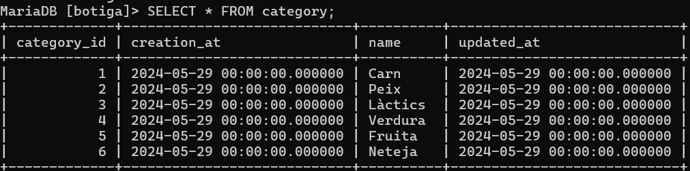
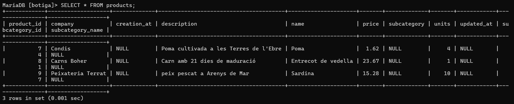

# botiga

Projecte SpringBoot i mariadb

En aquesta pràctica hem utilitzat el framework Spring, que ens permet, entre altres coses, crear aplicacions eficients mitjançant injeccions de dependències i aspectes modulars.

Per començar, s'ha completat la clase model Producte, fent una relació ManyToOne amb subcategories;

Un cop s'ha creat la classe Producte, hem continuat amb la classe repositori, que es la que "treballa" amb la base de dades. És una interfície que hereda de CRUDRepository<> i té uns métodes ja incorporats, tot i que li pots afegir més (de manera personalitzada). Treballa amb la annotació @Repository.

Acte seguit, treballarem amb les classes serveis, on si desenvoluparà tota o casi tota la lògica de negoci. Primer farem la classe interfície, on hi hauran els mètodes (o els essencials) buits, acte seguit, crearem la classe  servei amb l'implmentació d'aquests mètodes treballan juntament amb la capa repositori (als mètodes que així ho demanin), per implementar el component repositori utilitzarem l'annotació @Autowired, que ens permet fer la injecció del bean repositori.

ProductService:

ProductServiceImpl:

A continuació, hem seguit el mateix procediment amb eles clases Subcategory i Category:

Dins la classe Subcategory hi ha una relació @ManyToOne, on bàsicament, és dictamina el tipus de relació que tindrà amb l'objecte Category, una categoria pot contenir una o més subcategories, per exemple la categoria "Carn" podría tenir les subcategories: "carn vermella", "Embotits", etc.

I la classe category:

Seguint el procediment, hem continuat amb els components repositoris:

Subcategoria:

Categoria:

* Amb l'annotació @SuppressWarnings evitem possibles problemes d'excepcions quan el programa compil·li i detecti nulls relacionats amb el objecte que és treballi.

Pàgina desar:

Pàgina catàlog:

Pàgina Index:

Pàgina Search:

Base de dades:

- Categoria:

  
- Subcategoria:

  
- Productes:

  
