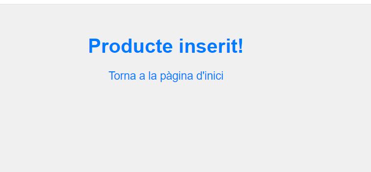

# botiga

Projecte SpringBoot i mariadb

En aquesta pràctica hem utilitzat el framework Spring, que ens permet, entre altres coses, crear aplicacions eficients mitjançant injeccions de dependències i aspectes modulars.

Per començar, s'ha completat la classe model Producte, fent una relació ManyToOne amb subcategories;

Un cop s'ha creat la classe Producte, hem continuat amb la classe repositori, que es la que "treballa" amb la base de dades. És una interfície que hereda de CRUDRepository<> i té uns mètodes ja incorporats, tot i que li pots afegir més (de manera personalitzada). Treballa amb la annotació @Repository.

Acte seguit, treballarem amb les classes serveis, on si desenvoluparà tota o casi tota la lògica de negoci. Primer, farem la classe interfície, on hi hauran els mètodes (o els essencials) buits, acte seguit, crearem la classe servei amb la implmentació d'aquests mètodes treballant juntament amb la capa repositori (als mètodes que així ho demanin), per implementar el component repositori utilitzarem l'annotació @Autowired, que ens permet fer la injecció del bean repositori.

ProductService:

ProductServiceImpl:

A continuació, hem seguit amb el mateix procediment amb les classes Subcategory i Category:

Dins la classe Subcategory, hi ha una relació @ManyToOne, on, bàsicament, és dictamina el tipus de relació que tindrà amb l'objecte Category, una categoria pot contenir una o més subcategories, per exemple, la categoria "Carn" podría tenir les subcategories: "carn vermella", "Embotits", etc.

I la classe category:

Seguint el procediment, hem continuat amb els components repositoris:

Subcategoria:

Categoria:

* Amb l'annotació @SuppressWarnings evitem possibles problemes d'excepcions quan el programa compil·li i detecti nulls relacionats amb l'objecte que és treballi.

  Creem les classes interfície amb els mètodes buits per les classes "Subcategory" i "Category".

  Subcategory:

  

  Category:

  

  Un cop les classes interfície tenen els mètodes necessaris fets, implementarem aquests últims dins les classes "SubcategoryServiceImpl" i "CategoryServiceImpl", on s'hi desenvoluparà tota la lògica de negoci, treballant juntament amb els repositoris pertinents.

  CategoryServiceImple:

  

SubcategoryServiceImpl:

Un cop tenim totes les classes fetes, treballarem amb el controler i les vistes:

Dins la classe Controller, hem desenvolupat 2 mètodes per poder fer la inserció de productes a la base de dades. Primer, hem fet el mètode que permet, a través del objecte Model, enviar informació a una vista concreta, en aquest cas, la vista és "desar", on li pasarem totes les subcategories (guardades en un Set després de buscar-les a través d'un findAllSubcategory() on s'ha utilitzat el component service, que a la vegada treballa amb el component repositori) al model amb la funció addAttribute, el primer paràmetre serà l'etiqueta del html amb el qual és relacionarà, i el segon paràmetre es el Set. I per acabar, li pasem un objecte Product buit, que ens serà de gran utilitat per anar-lo "omplint"  a través dels inputs del formulari de l'arxiu html.

Però, abans de començar a treballar amb el mètode i la vista, farem uns INSERT INTO dins les taules de categoria i subcateogira, ja que sinò, la pàgina "desar" ens dona error, jal no rebre ninguna subcategoria, ens surt un error 500.

Base de dades:

- Categoria:

  
- Subcategoria:

  

Un cop hem afegit categories i subcategories, repasem l'arxiu html:

Dins l'etiqueta form, tenim l'atribut "th:object" on se li pasarà l'objecte que li hem enviat. L'atribut th:action és l'URL del mètode que parlarem a continuació i el th:method està en post per la mateixa raò. 

En els inputs del formulari tenim l'atribut th:field, on li diem el camp que ha "d'omplir" dels objecte Product.

I per poder selccionar la subcategoria que volguem utilitzem l'etiqueta select on li pasarem, al igual que els inputs, l'atribut th:field, i dins de l'etiqueta option, farem un bucle a les subcategories, amb el th:value establim el valor del camp del formulari/select i amb el th:text  els text que és mostrarà.

Així és veuria la pàgina "desar":

Ara mateix la pàgina no fa res, ja que necesitem que quan es polsi el botó, les dades es guardin, per tant, farem el segon mètode dins del controller.

Com es pot veure, aquest mètode està en POST i la seva URL és "/guardarProducte", al igual "desar". Com a paràmetre té un objetecte product, amb l'annotació @ModelAttribute("product") li diem que el formulari ha d'omplir l'objecte. Si l'objecte és null, retorna a la pàgina "index", si pel contrari, l'objecte està ple, et guarda el producte i et porta a la pàgina "inserida".

Si compovem la pàgina "catalog" podem veure com el producte està dins la base de dades:

Hem hagut de modificar l'apartat Subcategoria a l'arxiu html, ja que no mostrava res. Li hem passat el product.subcategoryObj.name i, d'aquesta manera ja ha funcionat. Amb l'arxiu "search" hem hagut de fer el mateix.

i si el busquem per la pàgina "search", també ens sortirà.

Amb qualsevol d'aquestes pàgines podem tornar a l'inici, per mourens per les altres pàgines.

Taula productes:

- Productes:

  
